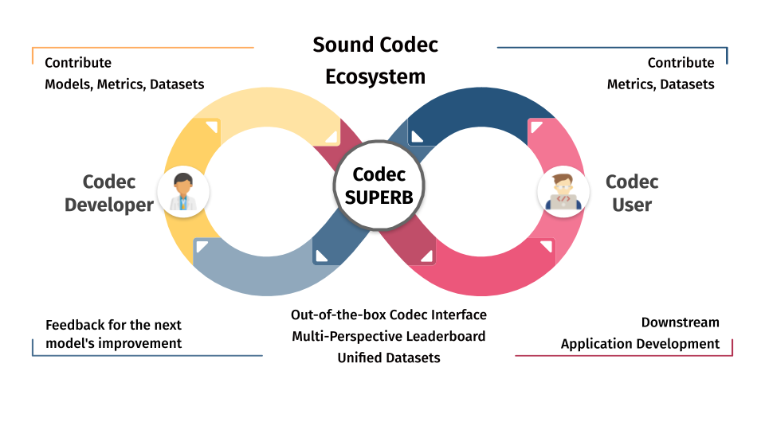

# Codec-SUPERB: Sound Codec Speech Processing Universal Performance Benchmark

<div align="center">



[](https://codecsuperb.com/)
[](https://arxiv.org/abs/2402.13071)
[](LICENSE)

**Official project repository for the Codec-SUPERB benchmark and codec-superb-tiny regression results.**

</div>

---

## 📖 Introduction

**Codec-SUPERB** evaluates neural sound codec models through downstream speech, audio, and music tasks. The benchmark focuses on whether codec tokenization and reconstruction preserve task-relevant information, and it provides a unified protocol for comparing codec families under consistent evaluation conditions.

---

## ✨ Key Features

* 🚀 **Out-of-the-Box Interface**: Intuitive API for easy integration and rapid experimentation with diverse codec models.
* 📊 **Multi-Perspective Leaderboard**: Comprehensive assessment across various speech processing dimensions with rankings for competitive transparency.
* 🏗️ **Standardized Environment**: Ensures fair and consistent comparisons by using uniform testing conditions for all models.
* 📚 **Unified Datasets**: Curated collection of datasets testing a wide range of real-world speech processing scenarios.
* ⚡ **Batch Processing Support**: Highly optimized batch encoding/decoding for significant performance speedups.

---

## 🛠️ Installation

```bash
# Clone the repository
git clone https://github.com/voidful/Codec-SUPERB.git
cd Codec-SUPERB

# Install dependencies
pip install -r requirements.txt
```

---

## 🚀 Quick Start

### List and Load Codecs

```python
from SoundCodec import codec

# List all available codecs
print(codec.list_codec())

# Load a specific codec
model = codec.load_codec('encodec_24k_6bps')
```

### Single Audio Processing

```python
import torchaudio

# Load audio
waveform, sample_rate = torchaudio.load('sample_audio.wav')
data_item = {'audio': {'array': waveform.numpy()[-1], 'sampling_rate': sample_rate}}

# Extract discrete units
sound_unit = model.extract_unit(data_item).unit

# Reconstruct audio
reconstructed = model.synth(data_item, local_save=False)['audio']['array']
```

---

## ⚡ Advanced Usage: Batch Processing

Codec-SUPERB supports efficient batch operations, typically providing **3-5x performance improvement** on GPU.

```python
# Prepare multiple samples
data_list = [
    {'audio': {'array': wave1, 'sampling_rate': 16000}},
    {'audio': {'array': wave2, 'sampling_rate': 16000}}
]

# Option 1: Batch extraction and decoding (Recommended)
batch_extracted = model.batch_extract_unit(data_list)
batch_decoded = model.batch_decode_unit(batch_extracted)

# Option 2: Complete batch synthesis pipeline
results = model.batch_synth(data_list, local_save=False)
```

> [!TIP]
> Grouping samples by similar lengths can further optimize batch processing efficiency.

---

## 🎯 Benchmarking & Leaderboard

The website leaderboard is generated from reruns on [voidful/codec-superb-tiny](https://huggingface.co/datasets/voidful/codec-superb-tiny), a 6,000-row Hugging Face subset with Speech, Audio, and Music splits. The dataset download is about 3.2 GB, so prefer targeted model reruns and cleanup flags when working on shared disks.

### Tiny Rerun Command

Run the ablation codecs directly on the tiny dataset without saving reconstructed audio files:

```bash
PYTHONPATH=. python3 scripts/benchmarking.py \
    --dataset voidful/codec-superb-tiny \
    --models llmcodec_abl_k1 llmcodec_abl_k3 llmcodec_abl_k10 \
    --max_workers 1 \
    --no_save_audio \
    --cleanup_cache
```

`--no_save_audio` prevents large `reconstructed_*` folders, and `--cleanup_cache` removes the temporary `cache_original` directory after evaluation. Omit `--cleanup_cache` only when you intentionally want to reuse the cached original WAVs for another immediate run.

### Update the Web Leaderboard

After benchmark JSON files are generated, rebuild the React data file:

```bash
python3 scripts/update_leaderboard.py
```

The updater scans `*codec-superb-tiny*evaluation_results*.json`, keeps the latest result for each model, and writes `web/src/results/data.js`.

### Current Tiny Rerun Results

| Model | BPS | TPS | Overall MEL (lower) | Overall PESQ (higher) | Overall STOI (higher) | Overall F0Corr (higher) | Source artifact |
| --- | ---: | ---: | ---: | ---: | ---: | ---: | --- |
| `llmcodec_abl_k1` | 0.5 | 50 | 1.225 | 1.935 | 0.657 | 0.619 | `voidful_codec-superb-tiny_evaluation_results_20260312_222533.json` |
| `llmcodec_abl_k3` | 0.5 | 50 | 1.219 | 1.934 | 0.659 | 0.616 | `voidful_codec-superb-tiny_evaluation_results_20260313_000723.json` |
| `llmcodec_abl_k10` | 0.5 | 50 | 1.223 | 1.936 | 0.659 | 0.620 | `voidful_codec-superb-tiny_evaluation_results_20260313_014706.json` |

### Optional Pre-Synthesized Workflow

For larger sweeps where repeated metric runs are needed, you can still create a synthesized dataset first. This uses more disk space because each codec split is materialized.

```bash
PYTHONPATH=. python3 scripts/dataset_creator.py \
    --dataset voidful/codec-superb-tiny \
    --specific_codecs llmcodec_abl_k1 llmcodec_abl_k3 llmcodec_abl_k10

PYTHONPATH=. python3 scripts/benchmarking.py \
    --dataset datasets/voidful/codec-superb-tiny_synth \
    --models llmcodec_abl_k1 llmcodec_abl_k3 llmcodec_abl_k10 \
    --no_save_audio
```

### Submit Results

1. Locate the generated JSON file, such as `voidful_codec-superb-tiny_evaluation_results*.json` for direct tiny reruns or `datasets_voidful_codec-superb-tiny_synth_evaluation_results*.json` for pre-synthesized reruns.
2. Open a **New Issue** in this repository titled `New Benchmark Result: [Codec Name]`.
3. Attach the JSON file or paste its content.

---

## 🛡️ Encode-Only Codec Support

Certain codecs (e.g., `s3tokenizer`) focus on tokenization and do not support reconstruction. Codec-SUPERB handles these automatically:

* **Benchmarking**: Automatically skipped during reconstruction evaluation.
* **API**: Raises `NotImplementedError` if `decode_unit` is called, with clear messaging.

---

## 🧪 Testing

```bash
# Run all tests
python -m pytest SoundCodec/test/

# Verify all codecs (Initialization & Synthesis)
PYTHONPATH=. python3 scripts/check_all_codecs.py
```

---

## 📝 Citation

If you use Codec-SUPERB in your research, please cite:
ACL:  
```bibtex
@inproceedings{wu-etal-2024-codec,
    title = "Codec-{SUPERB}: An In-Depth Analysis of Sound Codec Models",
    author = "Wu, Haibin and Chung, Ho-Lam and Lin, Yi-Cheng and Wu, Yuan-Kuei and Chen, Xuanjun and Pai, Yu-Chi and Wang, Hsiu-Hsuan and Chang, Kai-Wei and Liu, Alexander and Lee, Hung-yi",
    booktitle = "Findings of the Association for Computational Linguistics: ACL 2024",
    year = "2024",
    url = "https://aclanthology.org/2024.findings-acl.616",
    doi = "10.18653/v1/2024.findings-acl.616",
    pages = "10330--10348",
}
```

SLT:  
```bibtex
@article{wu2024codec,
  title={Codec-superb: An in-depth analysis of sound codec models},
  author={Wu, Haibin and Chung, Ho-Lam and Lin, Yi-Cheng and Wu, Yuan-Kuei and Chen, Xuanjun and Pai, Yu-Chi and Wang, Hsiu-Hsuan and Chang, Kai-Wei and Liu, Alexander H and Lee, Hung-yi},
  journal={arXiv preprint arXiv:2402.13071},
  year={2024}
}
```

Arxiv:  
```bibtex
@article{wu2024towards,
  title={Towards audio language modeling-an overview},
  author={Wu, Haibin and Chen, Xuanjun and Lin, Yi-Cheng and Chang, Kai-wei and Chung, Ho-Lam and Liu, Alexander H and Lee, Hung-yi},
  journal={arXiv preprint arXiv:2402.13236},
  year={2024}
}
```
---

## 🤝 Contribution & License

Contributions are highly encouraged! See [CONTRIBUTING.md](CONTRIBUTING.md) for details.
This project is licensed under the **MIT License**.

---

<div align="center">
Developed with ❤️ by the Codec-SUPERB Team
</div>
